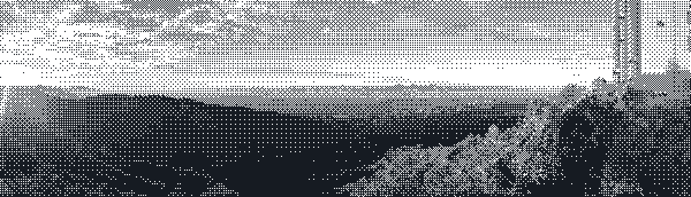

<a href="https://maps.app.goo.gl/6FWxVJk4RoagVWzd6"> <em><ins>Mt Umunhum, 37.1605&deg; N 121.8986&deg; W</ins></em></a>

# Alex Gao

Math-CS @ **UC San Diego**. 
SWE intern @ **IBM** prev. @ Climind 
founded [Signalor](https://signalor.app) 
🥇Gold, British Informatics Olympiad 
🥇 **2× Gold**, British Mathematical Olympiad I 
🥈 Silver, British Algorithmic Olympiad 
**6× hackathon winner**: YCxBrowserUse · SDxAnthropic · SDxVercel · DS3xBowCapital etc.. 

I have two career principles:
I want to build things that people use.
I yearn to span the knowledge space in its broadest definition.
Those two principles guide my professional career, and I have and will continuously work towards that.

## Stack

<!-- generated by scripts/make_badges.py -->

**Languages**  
              

**Frameworks & UI**  
           

**Backend & APIs**  
            

**Data & infrastructure**  
                 

**ML, data & robotics**  
                 

**Automation & tooling**  
              

## Stuff I built

| Project | What it is | Built with |
|---|---|---|
| **[Signalor](https://signalor.app)** | Public-sentiment platform for brands and investment firms. Sentiment **led Apple's YoY revenue growth by a quarter** on held-out data (r = 0.43) | SvelteKit, Bun, Prisma, Kafka, PostgreSQL, Redis |
| **[dont-hallucinate](https://pypi.org/project/dont-hallucinate/)** | Intercepts coding-agent shell failures, classifies what went wrong, suggests fixes — and mocks your agent. **500+ downloads** on PyPI and npm | Python, Bash, PowerShell |
| **[ferrodoc](https://github.com/alexgaoth/ferrodoc)** | Pandoc-compatible document converter in Rust — converts in your own process instead of spawning a 160 MB binary per file. **72× faster** on 10,000 DOCX (374 s → 5.2 s), **47/48** real pandoc command lines byte-identical. On [PyPI](https://pypi.org/project/ferrodoc/), crates.io and npm | Rust, Python, WASM, C ABI |
| **[weighted_map](https://github.com/alexgaoth/weighted_map)** | The contiguous US redrawn so distance is travel time, not space. **253 origins**, drive or fly, orbitable in 3-D ([live](https://cool-maps.vercel.app)) | Python, WebGL, GeoPandas, OSRM |
| **[Outcast Virus](https://devpost.com/software/outcast-virus)** | End-to-end autonomy OS for drone and ground-vehicle swarms — camera-based vSLAM, onboard perception, RL-trained multi-agent navigation. **1st place** at DS3 × Bow Capital: **won $4k, then a $100k offer** to continue | Python, ORB-SLAM3, YOLO11, Jetson, React, Three.js |
| **[3D Fractal Simulator](https://github.com/alexgaoth/JuliaSetFractal)** | Full 3-D Julia set generator and explorer, hand-written at 15 before LLMs ([live](https://intro.alexgaoth.com/JuliaSetFractal/)) | Unity, C# |
| **[routine-architect](https://github.com/alexgaoth/routine-architect)** | Deploys a fleet of scheduled cloud agents from a committed manifest, with a watchdog that audits the fleet daily | Claude Code, Python |
| **[claude-iterate](https://github.com/alexgaoth/claude-iterate)** | Builder/critic loop — fresh critic agents review each round against a frozen goal until the work passes | Claude Code, Markdown agents |
| **[UCSD Crimes](https://github.com/alexgaoth/UCSD_Crimes)** | Scrapes, organises and alerts on the UCSD campus crime log ([live](https://alexgaoth.com/UCSD_Crimes/)) | Python, Selenium, React, Node |

More: **[alexgaoth.com/projects](https://alexgaoth.com/projects)**

## Commits

---

🌐 [alexgaoth.com](https://alexgaoth.com) · [LinkedIn](https://linkedin.com/in/alexgaoth) · [X](https://x.com/alexgaoth) · ✉️ alexgaoth@gmail.com
